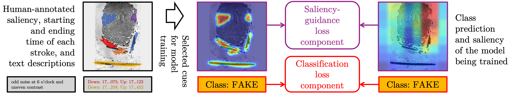

# Saliency-Guided Training for Fingerprint Presentation Attack Detection

Official GitHub repository for the paper: Samuel Webster and Adam Czajka, "Saliency-Guided Training for Fingerprint Presentation Attack Detection," IEEE/IAPR International Joint Conference on Biometrics, Osaka, Japan, September 8-11, 2025 **([ArXiv](https://www.arxiv.org/abs/2505.02176) | [IEEEXplore](https://ieeexplore.ieee.org/))**



We collected visual salient annotations and text descriptions, supporting decisions of humans detecting fake fingerprints, and used these salient features in saliency-guided model training paradigm to offer an effective fingerprint presentation attack detection method.

## Table of contents
* [Abstract](#abstract)
* [Datasets](#datasets)
* [Model weights](#weights)
* [Citation](#citation)
* [Acknowledgment](#acknowledgment)

<a name="abstract"/></a>
## Abstract

Saliency-guided training, which directs model learning to important regions of images, has demonstrated gen- eralization improvements across various biometric presentation attack detection (PAD) tasks. This paper presents its first application to fingerprint PAD. We conducted a 50-participant study to create a dataset of 800 human-annotated fingerprint perceptually-important maps, explored alongside algorithmically-generated "pseudosaliency," including minutiae-based, image quality-based, and autoencoder-based saliency maps. Evaluating on the 2021 Fingerprint Liveness Detection Competition testing set, we explore various configurations within five distinct training scenarios to assess the impact of saliency-guided training on accuracy and generalization. Our findings demonstrate the effectiveness of saliency-guided training for fingerprint PAD in both limited and large data contexts, and we present a configuration capable of earning the first place on the LivDet-2021 benchmark. Our results highlight saliency-guided training’s promise for increased model generalization capabilities, its effectiveness when data is limited, and its potential to scale to larger datasets in fingerprint PAD. All collected saliency data and trained models are released with the paper to support reproducible research.

<a name="datasets"/></a>
## Datasets

### Human Fingerprint Annotation Dataset

In our acquisition of human-annotative saliency, we conducted a 50-participant fingerprint annotation collection. Participants annotated samples from the 2015, 2017, 2019, and 2021 editions of the LivDet-Fingerprint competition. Each participant hand-annotated 16 bonafide and 16 spoof samples, producing 800 doubly-annotated fingerprints. Additionally, individual annotation stroke times (mouse down/up) are recorded, participants predicted the liveness (bonafide/spoof) for each sample, and, participants could textually describe their annotated region. 

We offer human annotations with the paper. However, we are not allowed (according to the dataset sharing license) to re-release the official LivDet-Fingerprint competition datasets. To access original files, please follow instructions provided by the competition organizers at [LivDet datasets page](https://livdet.org/registration.php).

### Algorithmically-sourced Pseudosaliency

Our experiments use pseudosaliency produced via various algorithmic means: minutiae-based regions (Neurotechnology VeriFinger SDK), low-quality maps (NIST Biometric Image Software), and human-mimicking autoencoder annotations. We offer these pseudosaliency maps with the paper.

### Obtaining Copies of the Datasets

Instructions on how to request a copy of the synthetic iris dataset used in this paper can be found at [the CVRL webpage](https://cvrl.nd.edu/projects/data/) (look for ND-FINGER-IJCB-2025 Dataset).

<a name="weights"/></a>
## Trained Fingerprint PAD models

Across all experiments, we train 720 individual models with varying configurations based on our five outlined scenarios. The models are available in this [box folder](https://notredame.box.com/s/rvrvz8d5eeuldeeffv7f8z6jdi3jala4).

<a name="citation"/></a>
### Citation

If you find this work useful in your research, please cite the following paper:
```
@inproceedings{websterIJCB2025,
      title={Saliency-Guided Training for Fingerprint Presentation Attack Detection}, 
      author={Samuel Webster and Adam Czajka},
      year={2025},
      booktitle={IEEE/IAPR International Joint Conference on Biometrics, Osaka, Japan, September 8-11, 2025},
}
```

<a name="acknowledgment"/></a>
### Acknowledgment
This material is based upon work partially supported by the National Science Foundation under Grant No. 2237880. Any opinions, findings, and conclusions
or recommendations expressed in this material are those of the authors and do not necessarily reflect the views of the National Science Foundation.
